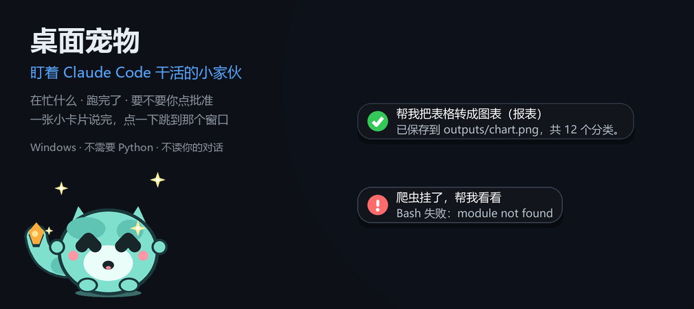
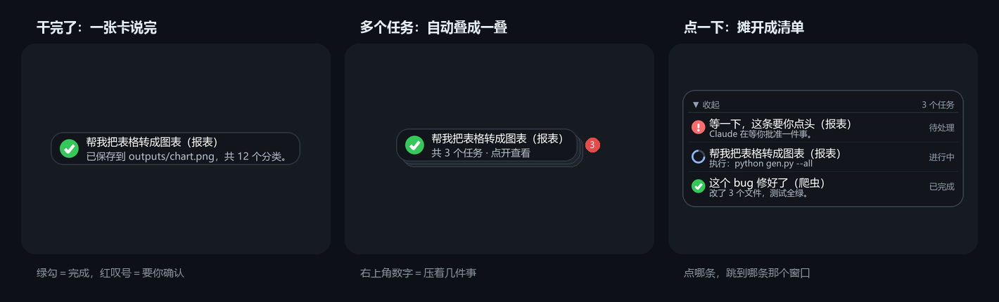
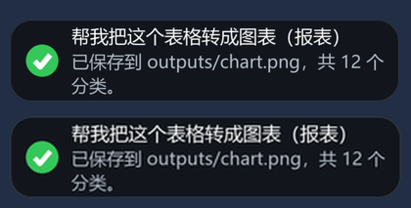

# 桌面宠物 · 盯着 Claude Code 干活的小家伙

> 一只趴在桌面的小程序。Claude Code 干活的时候，它替你盯着：
> **在忙什么 / 跑完了 / 要不要你点批准**，一张小卡片说完；
> 同时开好几个会话，卡片会叠成一叠，**点哪条就跳到哪条那个窗口**（VS Code 还会点名那个标签页）。

  

  

## 下载

去 [Releases](../../releases/latest) 下**最新版**，两种装法任选一种：

| 文件 | 装法 | 适合 |
| --- | --- | --- |
| `desktop-pet-x.y.z-setup.exe` | 双击，按向导点下一步 | 大多数人 |
| `desktop-pet-x.y.z-portable.zip` | 解压 → 双击 `接入ClaudeCode.cmd` | 不想装东西的人；**自动安装被拦时的退路** |

**自动安装没成功？就用手动装**：把 zip 解压到任意文件夹（比如 `D:\桌面宠物`），
双击里面的 `接入ClaudeCode.cmd`，看到"好了"就成。

## 装完怎么用

1. **新开一个 Claude Code 会话**（它启动时才读配置）
2. 在 Claude 里说句话、干点活，宠物就会动起来
3. 点它头顶的卡片 → 跳到对应的窗口；右键它 → 有菜单（演示、尺寸、藏起来、退出）

默认是**跟着 Claude 一起进退**的：Claude 关了，它守 3 分钟就退下；你下次开工它自己又冒出来。

## 卸载

- 安装程序装的：开始菜单 → 卸载桌面宠物（或控制面板）
- zip 装的：双击 `卸载ClaudeCode接入.cmd`，然后把文件夹删掉

两种方式都会把 `~/.claude/settings.json` **恢复成接入之前的那份自动备份**。

## ⚠️ 被 Windows / 杀软拦住了？

没签名的小程序（所有打包出来的 exe 都一样）经常会被拦一次，**这是误报**：

- 下载时提示"不常见"→ 点**保留**
- 双击时蓝色框"Windows 已保护你的电脑"→ 点**更多信息 → 仍要运行**
- 杀软弹"可疑程序"→ 选**允许 / 信任**

### 实测扫描结果（如实公开，两个文件都扫了）

| 文件 | 结果 | 报毒的是谁 |
| --- | --- | --- |
| 安装程序（32 MB） | **6 / 71** | CrowdStrike Falcon（ML 90%）、SentinelOne（Static AI）、DeepInstinct、Elastic、SecureAge、Bkav Pro |
| 免安装版主程序（2.7 MB） | **4 / 70** | Arctic Wolf、**Microsoft（Trojan:Win32/Wacatac.C!ml）**、SecureAge、Skyhigh |

**关键在于"报毒的那几个引擎是什么类型"**：

- 报毒的全是**机器学习 / 启发式**判定——注意名字里的 `!ml`、`Static AI`、`ML`、`Confidence 90%`，
  它们不看你代码干了什么，只看"文件长得像不像坏东西"
- 这个程序用 **PyInstaller** 打包，外壳的动作是"**自我解包 → 释放可执行文件 → 运行**"，
  而这恰好是恶意软件最经典的形态，所以 ML 引擎容易亮灯
- **Kaspersky、ESET、Bitdefender、Avast/AVG、Sophos、Trend Micro、Symantec、火绒、腾讯、金山、瑞星、阿里云**
  这些主流引擎**全部未报**

关于 `Wacatac.C!ml`：这是微软 ML 引擎**最出名的一类误报**，`!ml` 就是 machine learning 的意思。
大量用 PyInstaller / Electron 打包的合法软件都被它误伤过。**我会去微软提交误报**（见下）。

扫描结果链接（可自行核对，不用登录）：

- 安装程序：<https://www.virustotal.com/gui/file/5efa336ec98c392e1072bbbdd6205d662fa752a32e945b65732a54b46a4310d4>
- 免安装版主程序：<https://www.virustotal.com/gui/file/b6baf14262738113a2b56310d7c1998087dda0bfdd4c286e9cefe83ab5812d25>

### 被 Defender 拦了怎么办（三步）

1. **下载时**：浏览器提示"不常见"→ 点「保留」
2. **双击时**：蓝色框"Windows 已保护你的电脑"→ 点「**更多信息**」→「**仍要运行**」
3. **被隔离/删掉了**（Microsoft 报 Wacatac 时常见）：
   - 打开「Windows 安全中心」→「病毒和威胁防护」→「保护历史记录」→ 找到它 → 点「**还原**」
   - 或者「病毒和威胁防护」→「管理设置」→「**排除项**」→ 添加文件夹（把安装目录加进去）
   - 命令行也行（管理员 PowerShell）：`Add-MpPreference -ExclusionPath "D:\桌面宠物"`

### 想彻底避开打包器？（最硬核的一条路）

**直接跑源码**，不经过 PyInstaller，就不会有这类误报：

1. 装 Python 3.9+（勾 "Add Python to PATH"）
2. `pip install pillow`
3. 仓库里 `源码\` 文件夹下载下来 → 双击 `启动宠物.bat` → 双击 `接入ClaudeCode.cmd`

源码就在仓库的 [源码](源码/) 文件夹里，一共几个文件，谁都能看——这也是最有力的"我没干坏事"的证据。

SHA256 校验值：见 Releases 里的 `校验值.txt`。

实在不放心，用**免安装版**：解压即用，不写系统目录，不做任何安装动作。

## 它不会做什么

- 不读你的对话内容——它只看 Claude Code 自己发出的"事件"（开始干活、跑命令、等你批准、跑完）
- 不上传任何东西；只有检查更新时读一个公开的小文件（`update.json`），可以在 `pet_config.json` 里关掉
- 不动你的任何项目文件
- 不连 Claude 桌面 App / 网页版（那两者不提供事件接口，接不上）

## 要求

- Windows 10/11
- 装了 [Claude Code](https://claude.com/claude-code)（终端版或 VS Code 扩展都行）
- **不需要**装 Python（运行时已经打进去了）

## 更新

程序每 24 小时读一次本仓库的 `update.json`，发现新版本会在宠物头顶提示一句，点一下打开下载页。
不想被提示就改 `pet_config.json`：`"update_check": false`。

## 常见问题

<b>技术细节：为什么它在 150% 缩放的屏幕上不糊？</b>（好奇再点开）

 

左边是"让 Windows 拉伸整个窗口"的老做法，右边是"自己声明 DPI 感知 + 按屏幕缩放重画"的做法。
同一张卡片，中灰比例 0.223 → 0.162，一眼能看出区别：

**宠物没出现？** 先看 `启动宠物.bat` 能不能起来；起不来就看 `pet_errors.log`。

**点了卡片没反应？** 看 `pet_jump.log`，里面记着"点了哪张、找没找到窗口、删没删"。

**卡片不消失？** 点"那一叠"只是摊开，要点摊开之后清单里的某一条才会跳走并收卡。

**能接别的软件吗？** 能——任何软件只要能往 `pet_state.json` 写一行 JSON 就能驱动它，见 `README.md`。

## 许可

随便用，出问题别找我
